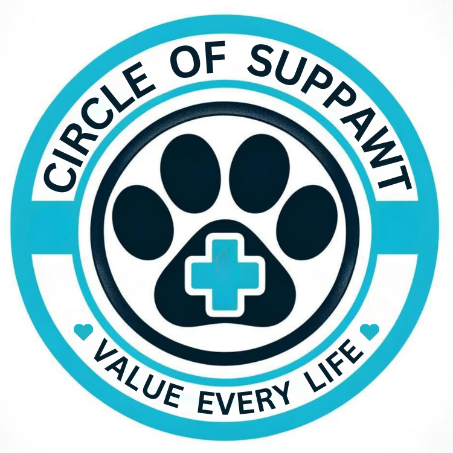

# Crowdfunding Front End
{{ Shannon Oliver }}

## Planning:

### Concept/Name
{{ Circle of Suppawt: A website to help those struggling to fund pet related medical bills }}

### Logo:

### Intended Audience/User Stories:
{{ Anyone that owns pets that need a hand from the community to contribute a donation towards the payment of vet costs; or for people who are simply just animal lovers in general that want to help out those in need. }}

#### [ X ] A link to the deployed project:
https://circle-of-suppawt.netlify.app/

### Front End Pages/Functionality:

#### [ X ] A screenshot of the homepage.

#### [ X ] A screenshot of the project creation page/form.

#### [ X ] A screenshot of a project with pledges.

### Additional Details:

#### [ X ] About Page.

#### [ X ] Contact Page.

#### [ X ] Profile Page.

#### [ X ] Edit Profile Page.

### Future Updates - TBA:
- {{ General UI fine tuning of styles/layouts }}
- {{ Implement PUT and DEL on project page }}
- {{ Have project status update to closed when goal met and hide pledge form }}
- {{ Add to profile page section for all pledges made and with a total of all donations; and a project list (if any have been made by user) }}
- {{ Improve homepage layout; add section for carousel of promoted projects at the top of page to scroll through (with the rest underneath still) }}

##### -----Test User Credentials-----

##### super user details:
##### username - admin
##### email - admin@admin.com
##### password - Dexter97

##### ----------

##### normal user details:
##### username - shannon111
##### email - shannon111@shannon111.com
##### password - shannon111